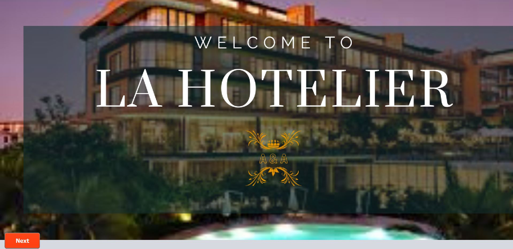

# 🏨 La Hotelier – All-in-One Hotel Management Application

**La Hotelier** aims to automate and improve the management of a hotel by utilizing Java in the NetBeans IDE. 

**Java Swing:** Java Swing is a graphical user interface (GUI) toolkit and widget library for Java. It is a part of the Java Foundation Classes (JFC) and provides a set of components for building desktop applications in Java. Swing offers a rich set of GUI components like buttons, text fields, labels, tables, menus, and more, enabling developers to create interactive and visually appealing interfaces.

## 🔑 Core Features

- **Reservation System**
  This module facilitates seamless reservation processes for guests . It offers functionalities allowing guests to make reservations, view room availability, and manage booking preferences .It ensures a user-friendly experience and provides flexibility in choosing accommodation options.
  
*The Home Page*

*Guest Home Page*

*Guest Eoom booking Page*

*Room Book form*

- **Check-In/Check-Out Management**  
  Smooth front desk operation with real-time room status.

- **Billing & Payments**  
  Generate invoices, apply discounts, and track payments effortlessly.

- **Room Service Ordering**  
  Guests have the convenience of ordering food from the hotel's restaurant directly from their rooms through this system. It allows for a seamless ordering process,   providing guests with a diverse menu selection and enhancing their overall experience.   

- **New Employee Addition**  
  Hotel management can efficiently add new employees through the system. This functionality includes capturing necessary employee details, assigning roles, and managing access permissions within the hotel's management platform.

- **Employee Management**  
  Admin panel to manage staff roles, duties, and access levels.

- **Billing and Invoicing**  
  Generates invoices, tracks payments, and manages billing details for guests. "La Hotelier" aspires to elevate the efficiency, guest satisfaction, and overall management standards of the hotel industry by amalgamating cutting-edge technology with intuitive and user-friendly functionalities.

